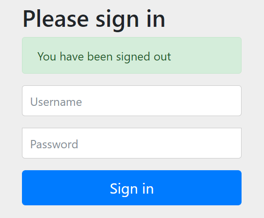

什么是Spring Authorization Server？

> Spring Authorization Server 是一个框架，提供了[OAuth 2.1](https://datatracker.ietf.org/doc/html/draft-ietf-oauth-v2-1-05)和[OpenID Connect 1.0](https://openid.net/specs/openid-connect-core-1_0.html)规范以及其他相关规范的实现。 它建立在[Spring Security](https://spring.io/projects/spring-security)之上，为构建 OpenID Connect 1.0 Identity Providers 和 OAuth2 Authorization Server 产品提供安全、轻量级和可定制的基础。

# 从一个Demo开始

学习第一步：搭建一个Spring Authorization Server Demo

1. `pom`依赖

   ```xml
   <?xml version="1.0" encoding="UTF-8"?>
   <project xmlns="http://maven.apache.org/POM/4.0.0" xmlns:xsi="http://www.w3.org/2001/XMLSchema-instance"
   	xsi:schemaLocation="http://maven.apache.org/POM/4.0.0 https://maven.apache.org/xsd/maven-4.0.0.xsd">
   	<modelVersion>4.0.0</modelVersion>
   	<parent>
   		<groupId>org.springframework.boot</groupId>
   		<artifactId>spring-boot-starter-parent</artifactId>
   		<version>2.7.4</version>
   		<relativePath/> <!-- lookup parent from repository -->
   	</parent>
   	<groupId>com.xiao.server</groupId>
   	<artifactId>spring-authorization-server-example</artifactId>
   	<version>0.1</version>
   	<name>spring-authorization-server-example</name>
   	<description>Spring Authorization Server Example</description>
   	<properties>
   		<java.version>1.8</java.version>
   	</properties>
   	<dependencies>
   		<dependency>
   			<groupId>org.springframework.boot</groupId>
   			<artifactId>spring-boot-starter</artifactId>
   		</dependency>
   
   		<dependency>
   			<groupId>org.springframework.boot</groupId>
   			<artifactId>spring-boot-starter-web</artifactId>
   		</dependency>
   
   		<dependency>
   			<groupId>org.springframework.boot</groupId>
   			<artifactId>spring-boot-starter-test</artifactId>
   			<scope>test</scope>
   		</dependency>
   
   		<!-- Spring Authorization Server -->
   		<dependency>
   			<groupId>org.springframework.security</groupId>
   			<artifactId>spring-security-oauth2-authorization-server</artifactId>
   			<version>0.3.1</version>
   		</dependency>
   	</dependencies>
   
   	<build>
   		<plugins>
   			<plugin>
   				<groupId>org.springframework.boot</groupId>
   				<artifactId>spring-boot-maven-plugin</artifactId>
   			</plugin>
   		</plugins>
   	</build>
   </project>
   ```

2. `Configuration`配置

   ```java
   /**
    * @Author XiaoYu
    * @Description Spring-Authentication-Server 最小配置
    * @Datetime 2022-10-13 16:29:28
    */
   @Configuration
   @EnableWebSecurity // 开启SpringWebSecurity
   public class SecurityConfig {
   
       /**
        * 	A Spring Security filter chain for the <a href="https://docs.spring.io/spring-authorization-server/docs/current/reference/html/protocol-endpoints.html">Protocol Endpoints.</a>
        * @param http
        * @return 协议端点的Spring安全过滤器链
        * @throws Exception
        */
       @Bean
       @Order(1)
       public SecurityFilterChain authorizationServerSecurityFilterChain(HttpSecurity http) throws Exception {
           OAuth2AuthorizationServerConfiguration.applyDefaultSecurity(http);
           http
                   // Redirect to the login page when not authenticated from the
                   // authorization endpoint
                   .exceptionHandling(
                           exceptions -> exceptions.authenticationEntryPoint(new LoginUrlAuthenticationEntryPoint("/login"))
                   );
   
           return http.build();
       }
   
       /**
        * A Spring Security filter chain for <a href="https://docs.spring.io/spring-security/reference/servlet/authentication/index.html">authentication</a>.
        * @param http
        * @return 用于身份验证的Spring Security过滤器链
        * @throws Exception
        */
       @Bean
       @Order(2)
       public SecurityFilterChain defaultSecurityFilterChain(HttpSecurity http) throws Exception {
           http.authorizeHttpRequests((authorize) -> authorize.anyRequest().authenticated())
                   // Form login handles the redirect to the login page from the
                   // authorization server filter chain
                   .formLogin(Customizer.withDefaults());
   
           return http.build();
       }
   
       /**
        * An instance of <a href="https://docs.spring.io/spring-security/site/docs/current/api/org/springframework/security/core/userdetails/UserDetailsService.html"> UserDetailsService</a> for retrieving users to authenticate.
        * @return UserDetailsService的实例，用于检索要进行身份验证的用户
        */
       @Bean
       public UserDetailsService userDetailsService() {
           UserDetails userDetails = User.withDefaultPasswordEncoder().username("user").password("password").roles("USER").build();
           return new InMemoryUserDetailsManager(userDetails);
       }
   
       /**
        * An instance of <a href="https://docs.spring.io/spring-authorization-server/docs/current/reference/html/core-model-components.html#registered-client-repository"> RegisteredClientRepository</a> for managing clients.
        * @return RegisteredClientRepository的一个实例，用于管理客户端
        */
       @Bean
       public RegisteredClientRepository registeredClientRepository() {
           RegisteredClient registeredClient = RegisteredClient.withId(UUID.randomUUID().toString())
                   .clientId("messaging-client").clientSecret("{noop}secret")
                   .clientAuthenticationMethod(ClientAuthenticationMethod.CLIENT_SECRET_BASIC)
                   .authorizationGrantType(AuthorizationGrantType.AUTHORIZATION_CODE)
                   .authorizationGrantType(AuthorizationGrantType.REFRESH_TOKEN)
                   .authorizationGrantType(AuthorizationGrantType.CLIENT_CREDENTIALS)
                   .redirectUri("http://127.0.0.1:8080/login/oauth2/code/messaging-client-oidc")
                   .redirectUri("http://127.0.0.1:8080/authorized")
                   .scope(OidcScopes.OPENID).scope("message.read").scope("message.write")
                   .clientSettings(ClientSettings.builder().requireAuthorizationConsent(true).build())
                   .build();
   
           return new InMemoryRegisteredClientRepository(registeredClient);
       }
   
       /**
        * 	An instance of com.nimbusds.jose.jwk.source.JWKSource for signing access tokens.
        * @return 用于签署访问令牌
        */
       @Bean
       public JWKSource<SecurityContext> jwkSource() {
           KeyPair keyPair = generateRsaKey();
           RSAPublicKey publicKey = (RSAPublicKey) keyPair.getPublic();
           RSAPrivateKey privateKey = (RSAPrivateKey) keyPair.getPrivate();
           RSAKey rsaKey = new RSAKey.Builder(publicKey).privateKey(privateKey).keyID(UUID.randomUUID().toString()).build();
           JWKSet jwkSet = new JWKSet(rsaKey);
           return new ImmutableJWKSet<>(jwkSet);
       }
   
       /**
        * 	An instance of java.security.KeyPair with keys generated on startup used to create the JWKSource above.
        * @return java.security.KeyPair的实例，其中包含在启动时生成的键，用于创建上面的JWKSource
        */
       private static KeyPair generateRsaKey() {
           KeyPair keyPair;
           try {
               KeyPairGenerator keyPairGenerator = KeyPairGenerator.getInstance("RSA");
               keyPairGenerator.initialize(2048);
               keyPair = keyPairGenerator.generateKeyPair();
           } catch (Exception ex) {
               throw new IllegalStateException(ex);
           }
           return keyPair;
       }
   
       /**
        * An instance of <a href="https://docs.spring.io/spring-authorization-server/docs/current/reference/html/configuration-model.html#configuring-provider-settings"> ProviderSettings</a> to configure Spring Authorization Server.
        * @return ProviderSettings的一个实例，用于配置Spring授权服务器。
        */
       @Bean
       public ProviderSettings providerSettings() {
           return ProviderSettings.builder().build();
       }
   
   }
   ```

3. 启动项目，访问[http://127.0.0.1:8080](http://127.0.0.1:8080)，如下图所示，账号为`user`，密码为`password`

   

4. 退出登录：[http://localhost:8080/logout](http://localhost:8080/logout)

   

**小结：**`SecurityConfig`

- `authorizationServerSecurityFilterChain`：协议端点的Spring安全过滤器链
- `defaultSecurityFilterChain`：用于身份验证的Spring Security过滤器链
- `userDetailsService`：`UserDetailsService`的实例，用于检索要进行身份验证的用户
- `registeredClientRepository`：`RegisteredClientRepository`的一个实例，用于管理客户端
- `jwkSource`：用于签署访问令牌
- `generateRsaKey`：`java.security.KeyPair`的实例，其中包含在启动时生成的键，用于创建上面的`JWKSource`
- `providerSettings`：`ProviderSettings`的一个实例，用于配置Spring授权服务器。

